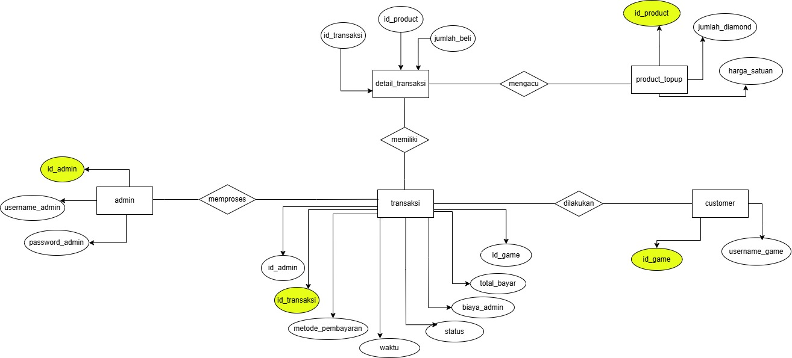

# 📄 UAS Pemrograman Basis Data – Invoice Game Top Up

## 📌 Deskripsi Proyek
Repository ini berisi proyek **Ujian Akhir Semester (UAS)** mata kuliah  
**Pemrograman Basis Data** dengan studi kasus **Sistem Invoice Game Top Up**.

Proyek ini bertujuan untuk merancang, mengimplementasikan, dan
mendemonstrasikan penggunaan **SQL** dalam pengelolaan basis data relasional,
mulai dari perancangan skema database hingga eksekusi query lanjutan.

---

## 🎯 Tujuan Proyek
- Menerapkan konsep **Pemrograman Basis Data**
- Mengimplementasikan **DDL, DML, dan TCL**
- Merancang **relasi antar tabel** menggunakan Primary Key dan Foreign Key
- Menggunakan query **JOIN, GROUP BY, HAVING, dan agregasi**
- Menyusun database yang terstruktur dan ter-normalisasi hingga **3NF**

---

## 🗂️ Struktur Database
Database bernama **`db_invoicegame`** terdiri dari tabel-tabel berikut:

- `customer` → menyimpan data player game  
- `admin` → menyimpan data admin pengelola sistem  
- `transaksi` → menyimpan data invoice transaksi top up  
- `produk_topup` → menyimpan data produk diamond/top up  
- `detail_transaksi` → menyimpan detail produk dalam transaksi  
- `metode_pembayaran` → menyimpan jenis metode pembayaran  

Relasi database mencakup:
- One to Many (1:N)
- Many to Many (M:N) melalui tabel penghubung

---

## 🔗 Relasi Antar Tabel
- **Customer – Transaksi** : One to Many  
- **Admin – Transaksi** : One to Many  
- **Transaksi – Detail_Transaksi** : One to Many  
- **Produk_Topup – Detail_Transaksi** : One to Many  
- **Transaksi – Produk_Topup** : Many to Many  

---

## 🧩 Diagram ERD Database
Diagram berikut menggambarkan hubungan antar tabel
pada database **db_invoicegame** secara visual.

> 📌 *Diagram ERD menunjukkan relasi Primary Key dan Foreign Key
antar tabel customer, admin, transaksi, produk_topup,
detail_transaksi, dan metode_pembayaran.*

---

## 🧾 Relasi Antar Table
Berikut adalah gambar desain antar table transaksi dan invoice game top up.

---

## 🧠 Materi SQL yang Digunakan

### 🔹 DDL (Data Definition Language)
- CREATE DATABASE
- CREATE TABLE
- PRIMARY KEY dan FOREIGN KEY
- ALTER TABLE

### 🔹 DML (Data Manipulation Language)
- INSERT
- UPDATE

### 🔹 TCL (Transaction Control Language)
- START TRANSACTION
- COMMIT

### 🔹 Query Lanjutan
- JOIN antar banyak tabel
- GROUP BY
- HAVING
- Fungsi agregasi (COUNT, SUM)

---

## 🛠️ Tools yang Digunakan
- **MySQL**
- **MySQL Workbench**
- **GitHub**

---

## ⚙️ Cara Menjalankan Proyek
1. Buka **MySQL Workbench**
2. Jalankan file SQL pada folder `sql/`
3. Database dan seluruh tabel akan terbentuk otomatis
4. Jalankan query `SELECT` untuk melihat hasil transaksi dan invoice

---

## 🔗 Repository GitHub
📎 Repository ini digunakan sebagai **bukti pengembangan proyek UAS**
dan menyimpan seluruh artefak proyek Pemrograman Basis Data.

---

✨ *Proyek ini dibuat untuk keperluan akademik dan pembelajaran SQL.*

**Dosen pengampu:**  
ridwan_dwiirawan@udb.ac.id
